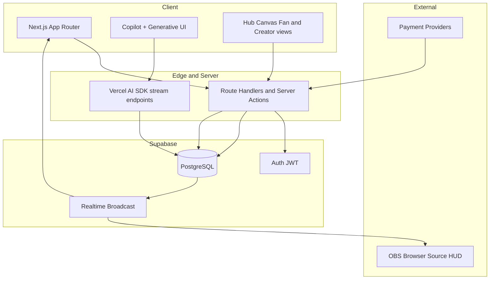
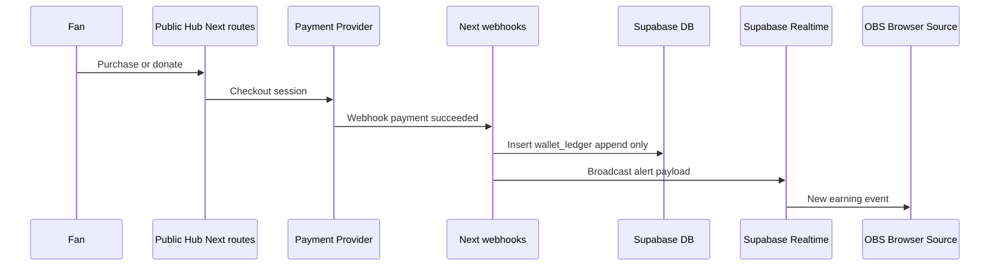

# PubliHub — System Architecture & Data Flow

Foundation documentation (Phase 0). Describes how the Next.js frontend, Vercel AI SDK Copilot, Supabase backend, and **OBS browser HUD** interact, including secure Generative UI.

**Open beta:** **`/hud/[token]`** is **mandatory**: fan → payment → **`wallet_ledger`** → **Supabase Realtime** → **HUD** so **donations and Hub interactions** appear **on stream** ([plan matrix — Open beta](./plan-matrix-and-feature-limits.md#open-beta-mvp-launch)).

## High-level topology

## Responsibilities by layer

| Layer | Role |
|--------|------|
| **Next.js (App Router)** | SSR/SSG where useful, protected routes, Server Actions for mutations, Route Handlers for webhooks and AI streaming. Single deployment surface for creator dashboard and public Hub pages. |
| **Supabase Auth** | Email/OAuth; JWT for RLS. Creators vs fans may share `auth.users` with role/profile distinction in `public` tables. |
| **PostgreSQL** | Source of truth for hubs, ledger, quests, subscriptions, products, webhook idempotency keys. |
| **Supabase Realtime** | Push wallet event and optional quest progress updates to **creator dashboard** and **OBS HUD browser source** (open beta: **Hub-originated** events). |
| **Vercel AI SDK** | Streaming assistant turns; tool calling for **structured** actions (navigate, open modal, propose withdrawal) rather than free-form UI code. |
| **LangGraph (server, PRD)** | Multi-step **agentic workflows** (e.g. webhook normalize → ledger/quest update → Realtime emit) orchestrated beside or behind AI routes; composes with the AI SDK; outputs stay **structured and validated**. See [PRD §5](./prd-mvp-day-one-launch.md#5-technical-architecture-guidelines-mvp). |
| **OBS HUD** | Static or minimally hydrated page: subscribes to a **narrow, signed or channel-scoped** realtime topic; renders alerts/TTS triggers from server-emitted payloads. |

## Core business flow (fan → wallet → HUD)

### Notes

- **Idempotency**: Webhook handlers store provider event IDs and ledger rows in a transaction to avoid double-credit.
- **RLS**: Fans read only public hub data; creators read/write their hub and wallet; ledger inserts may be **service-role only** from Next.js server (recommended) to keep invariants (no client-side balance mutation).

## Generative UI — secure approach

**Threat model**: The model must never emit executable code (no `eval`, no dynamic `Function`, no arbitrary React source). Treat LLM output as **untrusted hints** until validated on the server.

### Recommended pattern

1. **Allowlisted component registry** on the client: a map from stable string keys to React components, e.g. `WithdrawalConfirmCard`, `UpsellCta`, `QuestProgressSnippet`.
2. **Structured assistant output** via Vercel AI SDK **tool calls** (or JSON schema / Zod-validated structured chunks): each UI block is a small object `{ type: "ui_block", componentKey: "WithdrawalConfirmCard", props: { ... } }`.
3. **Server-side validation**: Route Handler validates `componentKey` ∈ allowlist and **props against Zod schemas** per key; strip unknown fields; enforce plan limits (e.g. no marketplace upsell on Free) before streaming to the client.
4. **Client renderer**: A single `GenerativeUIHost` switches on `componentKey` and renders from the registry; unknown keys render a safe fallback (“Action unavailable”).
5. **Navigation “for the user”**: Implement as explicit tools, e.g. `navigate({ path, tab })` or `openCopilotPanel({ view })`, executed only after server validation of allowed destinations for that user/session.

This yields Generative UI that is **predictable, testable, and safe** while still feeling dynamic.

## Realtime channels for HUD

- Prefer **private channels** or **user-scoped topics** with a **short-lived token** or **server-signed subscription claim** so fan traffic cannot subscribe to arbitrary creators’ streams.
- Payload should be minimal: `{ type, amount_cents, currency, label, ts, quest_id? }` to reduce PII in the browser source.

## Related docs

- [Streaming & OBS integration plan](./streaming-and-obs-integration-plan.md) (Twitch, Streamlabs, YouTube, HUD)
- [Plan matrix & feature limits](./plan-matrix-and-feature-limits.md)
- [Business Model Canvas](./business-model-canvas-publihub.md)
- [PRD — MVP (Day One Launch)](./prd-mvp-day-one-launch.md)
- [The Creator’s Journey (product narrative)](./publihub-creators-journey.md)
- [Supabase database schema (draft)](./supabase-database-schema.md)
- [Component tree and state strategy](./component-tree-and-state-strategy.md)
- [Phase 1 MVP execution plan](./phase-1-mvp-execution-plan.md)
